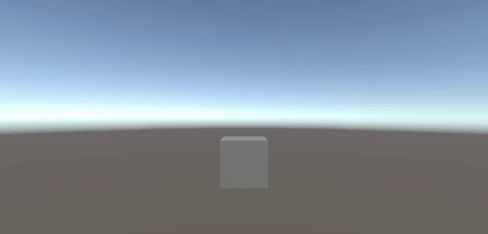

# 💾 Modular Data Persistence System for Unity

A robust, interface-driven save and load system for Unity. Designed to decouple data persistence logic from game mechanics, ensuring a scalable architecture for projects of any size.

## ✨ Key Features

* **Interface-Based Architecture (`IDataPersistence`):** Completely decoupled. Game objects (players, enemies, inventories) simply implement an interface to subscribe to the save/load events. The Save Manager doesn't need to know what they are, just that they hold data.
* **XOR Encryption Security:** Includes an integrated, toggleable XOR encryption layer to prevent players from easily tampering with their local save files (e.g., modifying health or currency).
* **Automated Component Discovery:** The system automatically scans the active scene to find and register any `MonoBehaviour` that implements the persistence contract. No manual wire-up required in the Inspector.
* **JSON Serialization:** Uses Unity's built-in `JsonUtility` for fast and lightweight data conversion.
* **OS-Safe Local Storage:** Utilizes `Application.persistentDataPath` to guarantee safe file writing permissions across all target platforms (Windows, Mac, iOS, Android) without administrator rights issues.

## 🗂️ Architecture Overview

* `GameData.cs`: The central data container (The "Safe"). Add your global variables here.
* `IDataPersistence.cs`: The contract interface. Any script that needs saving must implement this.
* `FileDataHandler.cs`: The OS-level messenger handling file streams, JSON conversion, and encryption.
* `DataPersistenceManager.cs`: The Singleton orchestrator that coordinates the reading, writing, and distribution of data across the scene.

## 🚀 How to Use (Plug & Play)

1. Drop the `DataPersistenceManager` script onto an empty GameObject in your scene (or use the provided Prefab).
2. Configure your file name and toggle the `useEncryption` boolean in the Inspector.
3. Add the global variables you want to save inside `GameData.cs`.
4. Make any script in your game saveable by adding the `IDataPersistence` interface and implementing the `LoadData` and `SaveData` methods.

---
👨‍💻 **About the Developer**
Hi! I'm Gonzalo, a Game Development student passionate about writing clean, modular, and easy-to-use code for Unity. 

Looking for solid architecture and modular assets for your game? I am available for freelance work! Let's talk!
